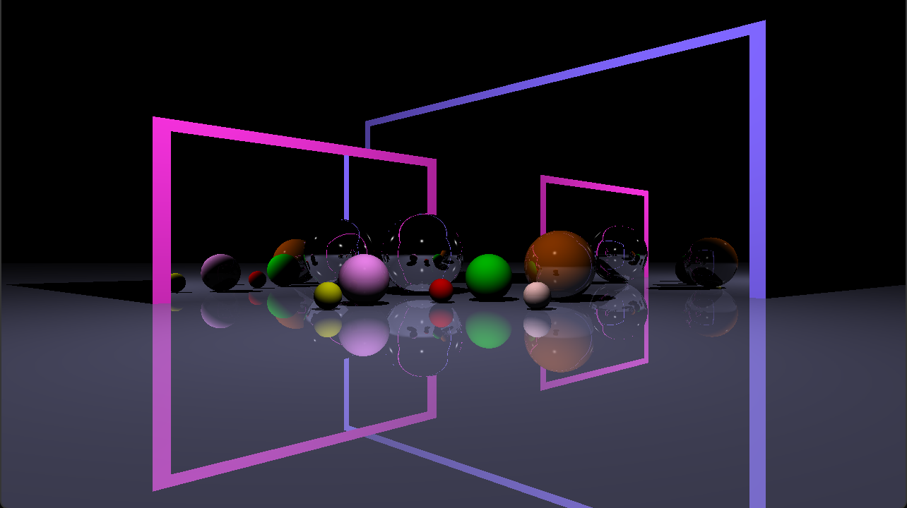

# Ray-Tracer
A Ray Tracer implemented using the OpenGL API and c++:  
I haved assumed mirror-like materials for all the objects defined in the scene; Only the perfect reflection direction is used to generate secondary rays.  
The lighting model is Blinn/Phong.  

The camera can be controlled with WASD keys and mouse.  

A short demo can be found [here](https://youtu.be/vwjhyR_FyyY).  
A screenshot of the scene:  

Many of the concepts used in this project drives from the [Introduction to Computer Graphics](https://graphics.cs.utah.edu/courses/cs4600/fall2022/) course by Cem Yuksel at the University of Utah
and the [learnopengl.com](https://learnopengl.com/) website by Joey de Vries. The Shader header file is exactly the same used in the learnopengl website.  
[GLM](https://glm.g-truc.net/0.9.8/index.html) library was used for the 3D mathematics.  
The project uses OpenGL 3.3.

